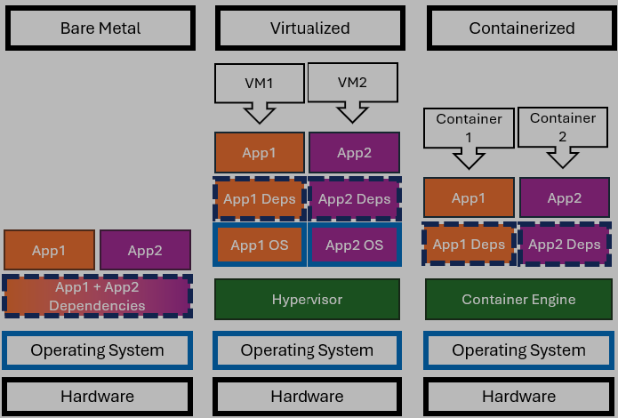

# Introduction to Containers for Data Science / Data Engineering

Open Data Science Conference East 2024

Michael Fudge

- Professor of Practice
- Masters in Information Systems Program Director
- Doctorate of Professional Studies Student

# Rationale

Have you ever: 

- Worked on a project on more than one computer?
- Shared a project with a team?
- Experienced: "but it works on my machine..."
- Spent hours trying to deploy your project live?
- If so, then containers are for YOU!

# What is a container?

- A container is a form of virtualization.
- Containers virtualize the application and its dependencies.
- The virtualization occurs closer to the application than the hardware.

# Containers, Virtualization, Bare Metal

# Benefits of Containers

- Reproducibility - drastically minimizes "but it works on my machine".
- Bundle the dependencies with your application.
- Can mimic complex environments with external systems.
- When combined with a git workflow, it can be team and cloud friendly.

# Container Lingo

- **Image** application + dependencies at rest, consumes disk
- **Tag** the version / release name of the image
- **Container** running image - consumes disk + RAM/CPU/Network
- **Port** expose a TCP/UDP Port outside the container
- **Volume** persistent storage for a container

# Our first container

- It always starts with a need
- Hmm. I'd like to use: https://jupyter.org/install
- Rather than install it on your computer, run it in a container!
- Portability! Reproducibility!

# Dockerhub: finding an image

- Dockerhub is an example of a container registry. https://hub.docker.com
- A catalog of container images in the cloud!
- https://hub.docker.com/search?q=jupyter%2Fminimal-notebook
- https://quay.io/repository/jupyter/minimal-notebook

# First docker command:

- Download an image from a registry
- Defaults to dockerhub: (skip this) 
 `docker pull jupyter/datascience-notebook:latest` 
- Pull from another registry: (do this)
 `docker pull quay.io/jupyter/datascience-notebook:latest`

# More Image Commands

- View images and their tags:  
 `docker images`
- Delete an image:  
 `docker image rm <image>:<tag>`

# Running an image

- Let's run the image:  
`docker run --name myjupyter -d quay.io/jupyter/minimal-notebook:lab-4.1.6`
- `--name` give the container a name
- `-d` run in the background, return to the console.

# Now its running, what can we do?

- See the logs / stdout / stderr:  
`docker logs myjupyter`
- See what is running:  
`docker ps`
- Stop a running container:  
`docker stop myjupyter`
- Delete a container:  
`docker rm myjupyter`

# Ports: 

- Accessing the service exposed by the application
- `-p OUTSIDE:INSIDE`
- In this example inside is `8888`, outside does not need to be the same.
- `docker run --name myjupyter -d -p 8888:8888 quay.io/jupyter/minimal-notebook:lab-4.1.6`
- Now a `docker ps` shows the port is exposed.
- See for yourself: http://localhost:8888
- find the token in the logs.

# Need for volumes

- Any content we create in the container will not persist invocations.
- Walk through example:
    - make a file in the work folder
    - `docker stop myjupyter`
    - `docker rm myjupyter`
    - `docker run --name myjupyter -d -p 8888:8888 quay.io/jupyter/minimal-notebook:lab-4.1.6`
    - find the token in the logs
    - go back to the work folder... file its gone :-(

# adding a volume

- Opening up a volume:  
`-v OUTSIDE:INSIDE`
- In this example outside is `work-vol` and inside is `/home/jovyan/work` this will depend on the image.
- Lets set the token while we are at it
- `docker run --name myjupyter -d -p 8888:8888 -e JUPYTER_TOKEN=odsc -v work-vol:/home/jovyan/work/`
- `  quay.io/jupyter/minimal-notebook:lab-4.1.6`

# Volumes

- `work-vol` is a system volume, managed by docker.
- System volumes are located at `/var/lib/docker/volumes/`
- You can also create volumes that map to a local folder we will see this in the next example.
- `docker volume ls`
- `docker volume rm <vol>`

# Too Many Commands? Try docker compose

- Docker compose allows you to manage containers through a configuration file
- Application definitions go in a file in `yaml` format.
- `docker compose up -f jupyter.yaml -d`
- `docker compose ps -f jupyter.yaml`
- `docker compose down -f jupyter.yaml`

# More Realistic Example

- Python program to read file, transform it, write file
- Open `workshop` folder in vscode.

# Building your own image

- `Dockerfile` explains how to build an image
- `FROM` is the base image
- `COPY` copies files into the image
- `RUN` executes a command in the image
- `ENTRYPOINT` defines the default command from `docker run`

# Example build and run your own image

- `docker buildx build pipeline/Dockerfile -t datapipeline:test`
- `-t` tags the file
- Image is now at `library/datapipeline:test`
- Run it:  
`docker run --name pipeline --rm library/datapipeline:test`
- `--rm` deletes the container after it runs

# Useful, not Realistic

- This is a useful way to run your programs
- But not a very realistic method to debug them!
- Hard to do a write run debug loop this way.
- Enter the Visual Studio Code dev containers!

# Dev containers

- Edit, Run, Debug in your container!
- `devcontainer.json` points to an image with code + debugger
- Normal docker build process for production deployments
- `docker-compose build`
- `docker-compose up`

# Overview of final pipeline

- Real world pipelines require many parts
- This example uses `docker-compose.yaml` with the dev container.
- The `docker-compose` has a bunch of other services!
- Pipeline watches for changes on object storage, then executes.
- Simulator generates data, dashboard displays info.

# Diagram of the pipeline

# Running the Pipeline

- Open the `workshop2` folder in a dev container.
- look at the `docker-compose.yaml` there are TWO!
- A `docker ps` reveals there are several services running
- run the pipeline to try it out!

# Developer flow

- You can debug the pipeline
- Add breakpoints and watches
- Last demo!

# Summary

- Containers virtualize our applications 
- Bundling the dependencies with the app.
- Find images for your containers on docker hub and quay.io
- You can manage multiple containers with docker-compose
- Write code inside containers with vscode dev containers!

# But Wait... More Container Fun!
- How about a containerized Spark cluster?  
`https://github.com/mafudge/docker-spark-cluster`
- Query your CSV/Excel files with SQL 
`https://github.com/mafudge/local-file-drill`
- Chat with your PDF file
`todo`

# Cleaning up

- You might want to reclaim some disk space after the talk
- `docker system prune --all --volumes`

# Thank You!

Introduction to Containers for Data Science / Data Engineering  

Open Data Science Conference East 2024  

Michael Fudge  
mafudge@syr.edu 

